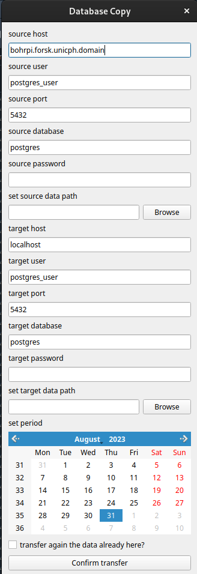

# Curve Storage: a database to store, find and save efficiently scientific datasets

This is a small python library made to interact with a PostGreSQL database server, used to store the metadatas of some curves that are stored somewhere. It comprises a GUI that allows easy visualisation, filtered search, fitting and deletion/editing of curves. 

## Installation

First you need a running PostgreSQL server. For a detailed description of how to install PostgreSQL and launch a server, see https://www.postgresql.org/docs/current/admin.html


After this, to install the library, open a command line after having installed git, then go to the repository you want to store it, then do: 

```bash
git clone http://gitea.qmpl.xyz/ThibaultCapelle/curve_storage.git 

cd curve_storage 

pip install psycopg2 pyqtgraph==0.11.0 

pip install –e . 
```
 Then open a python console, and type: 
```python
from curve_storage.database import SQLDatabase 

SQLDatabase.set_config() 
```
This opens another window:

<p>
    <a >
        
    </a>
</p>

Please set up the database and data informations and confirm.
### Basic use

#### From the API
To create a curve, simply enter:
```python
from curve_storage.database import Curve
curve=Curve(x_data, y_data, name='example', project='example_project',
 sample='example_sample', extra_param_name='example_value')
```
 
Each curve has two numpy arrays, assumed to be complex, which represents usually the x and y values to store, as well as a dictionnary with various parameters, here the extra_param_name, but it can be a lot of them. On top of it, it has special params linked to the database and which therefore can be searched with filters: a unique id, a name, a sample, a project and a date. It also has a dedicated folder that can be used, as well as a hierarchical system: each curve can have a parent and multiple childs.

To access a curve, for example with the id 201105: 
```python
from curve_storage.database import Curve 

curve=Curve(201105)
```

then you can access its data with:


```python
x,y= curve.x, curve.y #returns x and y data as complex numpy arrays.
params=curve.params #returns the parameters of the curve as a dictionnary
comment=curve.comment #returns the comment
childs, name, sample, project, parent=curve.childs, curve.name, curve.sample, curve.project #returns the childs, name, sample, project, parent of the curve
curve.get_or_create_dir() #returns the directory of the curve. If it does not exist yet, create it
curve.move(parent) #move the Curve curve as child of the other Curve parent. Note that it also save the curve and the parent
curve.name="hello" #make a change in an instance
curve.save() #synchronize the updates of the instance with the data and database
curve.delete() #delete the curve in the data and database
```

#### From the GUI
The curves can be searched and addressed easily with the GUI, than you can call with:
```python
from curve_storage import gui
```
This opens the following window:
 <p>
    <a >
        
    </a>
</p>

on the left (1) side you can see the curves that match the query, as well as some options to edit this query. The selected curve data are displayed in the center (2) window, in the format chosen with the top panel. The right (3) panel displays the parameters of the selected curve, and the bottom (4) panel shows some additional options: - the comment associated with each curve, that can be edited and saved, the fitting options, that use the x data selected y the data viewer, and the default plot figure options, which are used to save a default plot of the viewed data. You can also create (if it has not been created yet) or open (if it has been created previously) the curve directory.

If you right click on the curve tree viewer (1) you have an additional menu:
 <p>
    <a >
        
    </a>
</p>

Here you can delete the curve (it will delete the database entry recursively with its childs, remove the curve has a child of its parent if it is the child of a curve, delete the directory if it exists, and delete the data), move it to become the child of another curve, edit it to change its name, sample or project, or plot it. For all this options you can select several curves to apply it to all curves. If you select plot, it will show a new plot window:

<p>
    <a >
        
    </a>
</p>

Here you can print the name, and/or time and/or id of each curve. You can change their print options, hide some of the curves, and if you right click you can choose to plot it, which creates a nice matplotlib figure saved in the directory of the curves.

If you click on "show filters" a new panel opens on the left:

<p>
    <a >
        
    </a>
</p>

from there you can activate or delete all the filters and creating new one. The first default filter is "id=parent", which means that it shows only the top curves of the hierarchical system, unless you expand each of the curves. The second one is "project=the_default_project", which can also be edited separately in the tree viewer (1) top options. You can make filters about name, date, sample, id, and project, and you can relate them to the query with the right succession of "AND" and "OR" booleans. The deactivated filters or groups of filters are ignored.

A right click on the param panel (3) opens a context menu that you can use to add or delete a parameter.

### Advance Use

#### Create Local Copy

if you need to analyse a subset of existing data without using the VPN, or when you are limited by the reading speed with the database, and you want to keep using the scripts that you designed with this library syntax, you can run a postgresql database server locally on your computer, configure it and then copy part of the data and database entries on your local machine. This will have the advantage to be extremely fast to read and analyze. However, not that resynchronize locally edited data with the database can be tricky, so careful about writing with you local copy.

To do this, first launch a postgresql server, following instructions on "https://www.postgresql.org/docs/current/admin.html", and configure it such that it has a database running accepting local connections.

Then enter:

```python
from curve_storage.database import SQLDatabase 

SQLDatabase.create_local_copy()
```

This opens the following window:

<p>
    <a >
        
    </a>
</p>

Set up the source and target database and data informations, as well as the time period you are considering (click on the beginning date, then hold shift and click on the end date). Then click on "Confirm transfer". You can then set up the database with:

```python
from curve_storage.database import SQLDatabase 

SQLDatabase.set_config()
```

as when you installed the library (see above).

